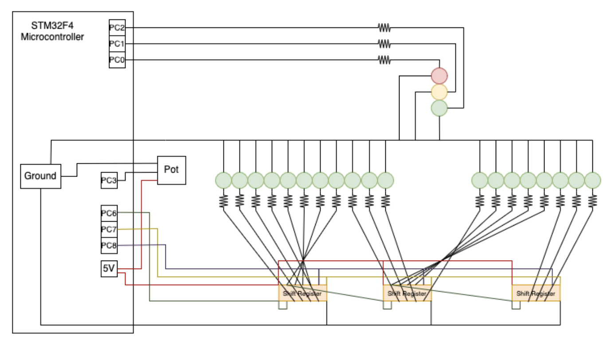

# Traffic light simulator

This is the implementation of a traffic light system with simulated one-way traffic that my partner and I developed for our Real Time Computer Systems Design Project class.

This project made use of FreeRTOS and was implemented on a STM32F4DISCOVERY microcontroller ARM Cortex-M4 target.

## Hardware

This project required the design and implementation of both hardware and software. 

The green LEDs organized in a row represent possible vehicle locations before and after the traffic light. The potentiometer allows for the rate of traffic generation to be increased, and the traffic light system changes the frequency of light changes based on the rate of incoming traffic.

## Software 

This project was implemented with documentaion in the main.c file provided. FreeRTOS was used to implement software timers, tasks, and queues that pass state between eachother, rather than making use of a polling loop.

The code we implemented for this project can be found at [src/main.c](src/main.c).